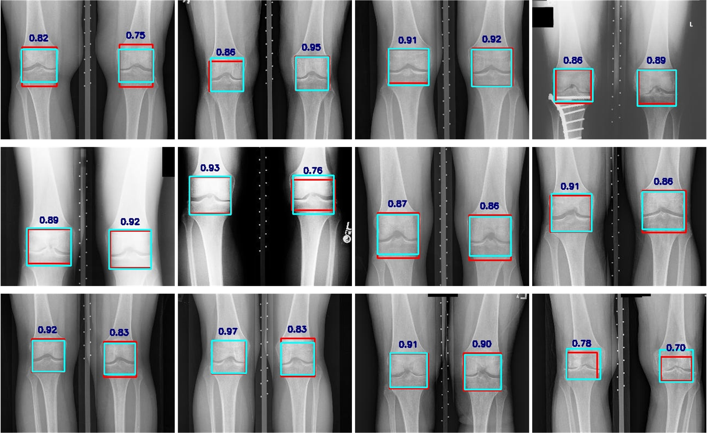

<!--# Information
  -->
# DFGR
Deep Feature Graph Representation for Predicting Knee Osteoarthritis

### Our model:

# DataSet
Data used in this article were obtained from the Osteoarthritis Initiative (OAI) database, which is available for public access at http://www.oai.ucsf.edu/. datasets used are baseline knee images with 0.C.2 and 0.E.1.

### OAI was divided into:

|              |  KLO | KL1  | KL2  |  KL3 | KL4 | Total |
|:-------------|-----:|:----:|:-----|-----:|:---:|:-----:|
| Training set | 2759 | 1278 | 1900 |  992 | 236 | 7165  |
| test set     |  689 | 319  | 474  |  247 | 59  | 1788  |
| Total        | 3488 | 1597 | 2374 | 1239 | 295 | 8953  |

# Performance

### YOLOv7-tiny inference results with IoU:

### The results for DFGR:
coming soon  =_=

### The results for Ensemble Model & Comparison with sota in OAI(end-to-end):
coming soon  =_=

# Credibility
Main issue with artificial intelligence models is not only accuracy but also the credibility of their decisions.

# more

### Comparison with doctors:
coming soon  =_=

### paper
[论文链接]([https://ieeexplore.ieee.org/xpl/conhome/10498130/proceeding](https://ieeexplore.ieee.org/abstract/document/10498947))

